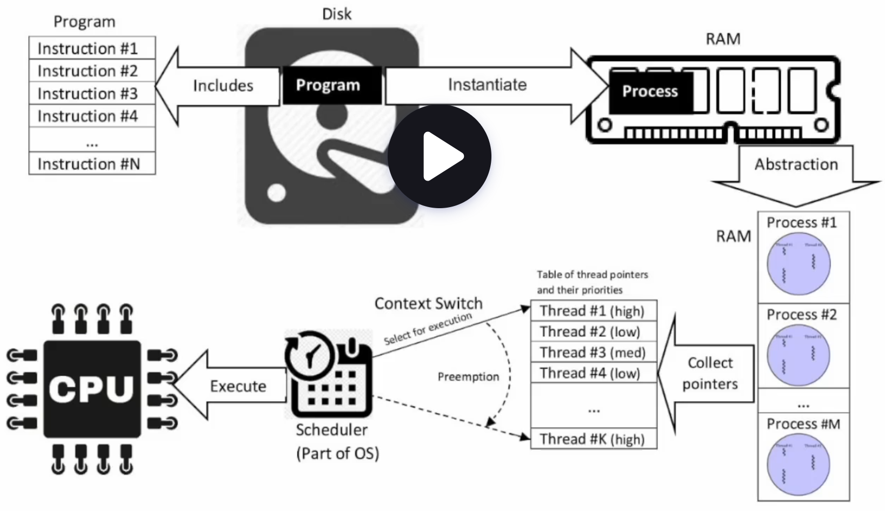
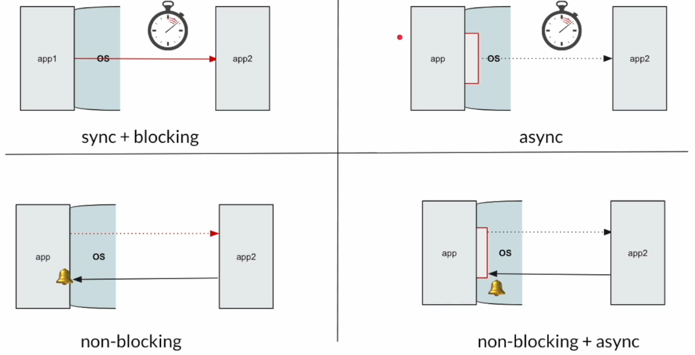
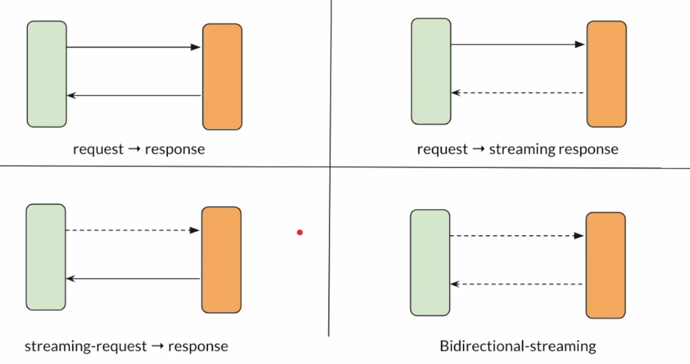

# Reactive programming in Java

- Reactive programming set of principles:
  1. non-blocking
  2. asynchronous
  3. stream based communication
  4. backpressure handling

## Introduction

### Process/Thread/CPU/RAM/Scheduler

 <br>

#### Process

- a process - an instance of a computer program
- it is loaded into memory; it has its own isolated memory space (code, data, other resources allocated by the OS like memory, socket etc.)
- it is heavy-weight (expensive to create and destroy a process)

#### Thread

- a part of a process
  a process can contain one or more threads
- threads within a process can share the memory space
- process - a unit of resource, thread - a unit of execution

#### Scheduler

- it will assign the thread to the CPU for execution (it will determine how long the thread can execute)
- one thread can be executed at processor at one time (multiple processors - multiple threads can be executed simultaneously)
- modern multi-core processors can be seen as multiple processors
- so, when we have a lot of threads and just one processor, scheduler keeps switching between them, meaning which one is currently being executed by the processor -> context switch
  - once the thread execution is stopped, its context has to be stored somewhere, so it can be resumed later once it gets assigned some time to be executed by the CPU
- more threads do not mean better performance; one CPU can run 1 thread at a time
- Java thread
  - introduced ~ 25 years ago
  - 1 Java thread = 1 OS thread
  - OS thread is the unit of execution

```java

void method1() {
    int a = 5;
    method2();
    ...
    ...
}

void method2() {
    int b = 3;
    method3();
    ...
    ...
}


void method3() {
    ...
    ...
}
```

- WHen a Java threads is executing these methods, the OS scheduler will keep switching threads
- method-specific local variables, function calls and information should be stored somewhere -> stack
- Heap - storing objects
- Stack - local variables, object references and the function call information; each and every thread has its own stack memory
- stack memory size is determined when the process starts or a thread is created (once a thread is created, it cannot be changed)
- that size may vary depending on the OS and the architecture

  - Linux/x64: 1024 KB
  - Linux/Aarch64: 2048 KB
  - macOS/x64: 1024 KB
  - macOS/Aarch64: 2048 KB
  - Windows: the default value depends on the virtual memory

- Problem statement:
  - CPU is very expensive -> try to use CPU as much as you can
  - Often times in microservice architecture, we have many network calls. Network calls are slow, so threads will be idle. People create too many threads to make use of CPU.
  - threads are expensive resources -> expensive = heavy/consumes memory
  - we need a mechanism to make these network calls more efficient without wasting system resources

### I/O models



#### sync blocking

- you call an insurance company
- they will not pickup immediately, but rather that would be pickedup by an automated response which would make you wait until someone picks up the phone
- so, you wait on the line sitting idle until the response comes back
- the same way, your app makes a call to another app and it's being blocked until the response comes back

#### async

- you call an insurance company
- I won't wait, but rather I will ask my friend to do so, I call them, leave my friend on the line to wait for the response
- because I delegated a task, I'm not blocked
- one thread can create another thread to do that network call and that thread can do something else; still the thread that is waiting for a response to come back is blocked until that happens
- to avoid creating too many threads, we can use non-blocking communication

#### non-blocking

- you call an insurance company
- all operators are busy. Instead of waiting, you leave a phone number and someone will call you back once there is a free operator.
- so, if a thread sends an async call, it is not blocked, it can do something else, but once the response comes back (the OS will notify it)

#### non-blocking async

- you call an insurance company
- all operators are busy. Instead of waiting, you leave a phone number and someone will call you back once there is a free operator.
- instead of giving my number, I give my friend's number, so they call him back. None of us are blocked, but once the operator calls back, it will call him, not me.
- if a thread sends a non-blocking async call, the OS will notify about the response not that thread, but the other thread that will be responsible for processing that response

- this communication model is complex; that's why we have a reactive programming paradigm which simplifies this

### Communication patterns

- request -> response model, just a simple communication model
  - for that, you can use a virtual thread
- but, reactive programming brings more patterns
  1. request -> response
  2. request -> streaming response - you send a request and get multiple responses (practically the same connection is used to stream multiple messages - your order is accepted, your order is being prepared, you order is being delivered, a driver is 5 miles away, a driver is 2 miles away, a driver is in front of your door, your order is delivered); for stock-price updates
  3. streaming request -> response - the client sends a bunch of messages (Google doc updates, Apple watch sends heartbeat data); video streaming
  4. bidirectional-streaming; online game



### Reactive programming

- in the world of modern applications where there are a lot of things happening (many updates, notifications), a regular programming model (client-server) is not the best option
- around 2014, a new spefication came out - Reactive Streams

  > Reactive Streams is an initiative to provide a standard for asynchronous stream processing with non-blocking back pressure. This encompasses efforts aimed at runtime environments (JVM and JavaScript) as well as network protocols.

- Reactive programming

  - a programming paradigm designed to **process streams of messages in a non-blocking and asynchronous manner, while handling backpressure**
  - it based on the Observer design pattern

- C - procedural programming language
  - unit of reusability is function
- Java - Object oriented programming language

  - unit of reusability is class
  - data and methods are grouped together
  - list/set/map...
  - but we do NOT have tools ti simplify the non-blocking async IO calls

- Reactive programming
  - for IO calls
  - it complements object-oriented programming by providing powerful tools and abstractions to handle asynchronous IO calls and manage complex data flows in modern applications

### Reactive streams specification

- based on the observer pattern
- An example of a Twitter followers
  - let's say that a famous actor tweeted something
  - all followers of that actor will received that tweet on their feed (even a notification about)
  - they subscribed to that topic
  - when that actor publishes, all subscribers of that topic (follower of that actor will receive a notification/tweet on their feed)
  - observe and react in case of changes

```java

public interface Publisher<T> {
    public void subscribe(Subscribe<? super T> s);
}
```

```java

public interface Subscriber<T> {
    public void onSubscribe(Subscription s);
    public void onNext(T t);
    public void onError(Throwable t);
    public void onComplete();
}
```

```java

public interface Subscription {
    public void request(long n);
    public void cancel();
}
```

- what if a subscriber should also act as a publisher to some other subscribers

```java

public interface Processor<T, R> extends Subcriber<T>, Publisher<R> {

}
```

- So the publisher is at the top, then we could have a dozen (chain of) of processor and at the end of this chain we would have subscribers
- JPA is an interface, Hibernate is its implementation
- Reactive streams is an interface; its implementation:
  - Akka streams
  - rxJava2
  - Reactor
    - Spring WebFlux
    - R2DBC (Postgres, MySQL, H2...)
    - Redis
    - Elasticsearch
    - Mongo
    - Kafka
    - RabbitMQ
      ....

### Publisher/Subscriber communication

- Step 1: subscriber wants to connect

```java

public interface Publisher<T> {
    public void subscribe(Subscribe<? super T> s);
}
```

- Step 2: publisher calls `onSubscribe`

```java

public interface Subscriber<T> {
    public void onSubscribe(Subscription s);
    public void onNext(T t);
    public void onError(Throwable t);
    public void onComplete();
}
```

    - publisher passes a subscription to its subscriber

- Step 3: subscription

```java

public interface Subscription {
    public void request(long n); // to request data
    public void cancel(); // to cancel the subscription
}
```

- Step 4: publisher pushes data via `onNext`

  - publisher calls `onNext` of its subscriber to push data to it; 3 items, 3 times will call `onNext`
  - the publisher gives up to that number of items (e.g. if a subscriber asked for 3 items, it will give no more than 3; if it has 3, it will give it, otherwise it will not notify that it has not that many items after sending all items it has)

- Step 5: `onComplete`

  - publisher will NOT send anything after `onComplete`
  - this method is called when the publisher has nothing to emit or emitted everything it had, i.e. its job is done

- Step 6: `onError`

  - publisher will not send anything after `onError`
  - the publisher passes down the exception details via this `onError` method

- Summary:

  - the subscriber is subscribed to the publisher via `onSubscribe` method
  - on that occassion, the publisher sends a subscription object
  - that object is used to request items to the published based on the amount of items requested
  - publisher calls from 0...N times `onNext` of its subcriber and it passes data items in that way
  - if something goes wrong, the publisher calls `onError` - that method can be called only once
  - if the subscription is complete/emitting is done - it calls `onComplete`

- Terminology

1. publisher
   - source
   - observable
   - upstream
   - producer
2. subscriber
   - sink
   - observer
   - downstream
   - consumer
3. processor
   - operator

- anything which gives the data can act like a producer; anthing which ask for the data can act like a subscriber
- pillars of reactive programming:

  - stream of messages
  - non-blocking
  - asychronous
  - backpressure

- Rules in reactive programming:

1. Subscriber has to subscribe and request for producer to produce items! Till then the producer does not produce anything (be lazy as much as possible)
2. Subscriber can cancel anytime (producer should not produce data after that)
3. Producer will produce items via `onNext`
4. Producer will call `onComplete` ater emitting 0..N data
5. Producer will cal `onError` in case of issues
6. Producer will NOT invoke anything after `onComplete`/`onError`. Subscription request/cancel will have no effect after that.

## Mono/Flux

- Reactive streams - specification; Reactor - implementation

```java
public interface Publisher<T> {
    public void subscribe(Subscriber<? super T> s);
}
```

- two implementations - `Mono` and `Flux`
- `Mono`
  - emits 0 or 1 item (it doesn't matter how many items the subscriber requested)
  - followed by an `onComplete`/`onError` action
- `Flux`

  - emits 0, 1,...N items
  - followed by an `onComplete/onError`
  - it can be an neverending infinite stream

- Why Mono and Flux

  - both of them can handle things in a non-blocking asynchronous manner
  - standard approach vs reactive approach

  ```java
  interface CustomerRepository extends JpaRepository<Customer, Long> {

      List<Customer> findByFirstName(String firstName);

      Optional<Customer> findById(Long id);
  }
  ```

  ```java
  interface CustomerRepository extends ReactiveCrudRepository<Customer, Long> {

      Flux<Customer> findByFirstName(String firstName);

      Mono<Customer> findById(Long id);
  }
  ```

- Flux
  - Stream of messages
  - Backpressure (producer emits too much data which consumer cannot handle)
  - many additional methods specific to handle stream processing
- Mono

  - no stream!
  - no backpressure!
  - a lightweight producer
  - request-response model

- Mono methods:
  | Factory method | Usage |
  |------------ |------------------------- |
  | `just` | When the value is in memory already |
  | `empty` | No item to emit |
  | `error` | Emit error |
  | `fromSupplier` | defer execution by using `Supplier<T>` |
  | `fromCallable` | defer execution |
  | `fromFuture` | Publisher from `CompletableFuture` |

- because Mono is a reactor, this is fine:

```java
Publisher<String> mono = Mono.just("hello world");
```

- `Mono.just` - when the value is already stored in memory and we just want to emit
